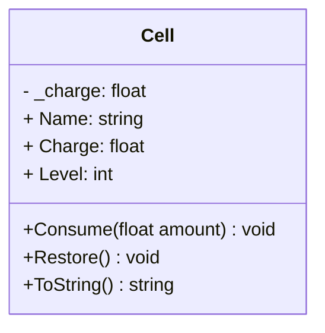

```mermaid
classDiagram
    class Cell{
        - _charge: float
        + Name: string
        + Charge: float
        + Level: int
        
        
        
        +Consume(float amount) void
        +Restore() void
        +ToString() string

        
    } 
    

```