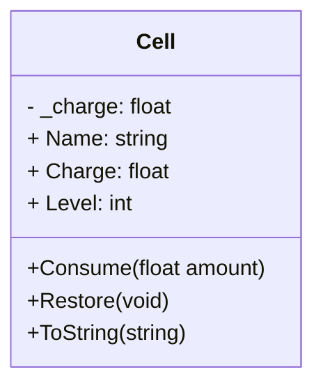

```mermaid
classDiagram
    class Cell{
        - _charge: float
        + Name: string
        + Charge: float
        + Level: int
        
        
        
        +Consume(float amount)
        +Restore(void)
        +ToString(string)
    } 
    

```